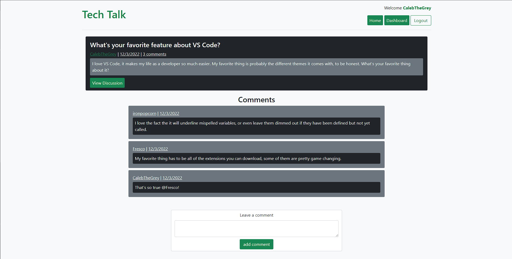

# Tech Talk

## Description

Tech Talk is a CMS-style blog site where users can create an account and talk about the latest trends regarding tech. Tech Talk was developed using the MVC Paradigm: Sequalize is used to manage the databse while Handlebars.js allows for the display of dynamic data to users. The application also uses the express-session npm to authenticate user sessions and conditionally render content on to the page.

## Deplyed Website

<!-- Link here -->

## Built With:

- HTML5
- CSS3
- JavaScript
- Node.JS
- Express.JS
- Bootstrap
- Handlebars.JS
- MySQL2
- Sequelize
- NPM Packages

## Screenshot

## Contributions

Made by Caleb Funderburk